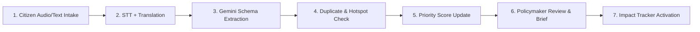

# CivicBridge AI

> **BRICS Innovation Theme:** AI for Digital Public Infrastructure & Governance  
> **Subtitle:** From multilingual citizen voices to ranked, evidence-backed infrastructure projects.

## Deployed backend (Google Cloud)

The private Cloud Run pipeline in project `civicbridge-1`, region `us-central1`, is:

`civicbridge-citizen-channels` → `request-created-v1` / `request-confirmed-v1` → `civicbridge-ai-normalization` → `request-normalized-v1` → `civicbridge-data-intelligence` → `hotspot-updated-v1` → `civicbridge-policy-impact`.

Pub/Sub pushes use OIDC as `civicbridge-pubsub-push@civicbridge-1.iam.gserviceaccount.com`. Each target grants that identity `roles/run.invoker`; services remain unavailable to anonymous callers. Runtime identities are `civicbridge-citizen-channels`, `civicbridge-ai-normalization`, `civicbridge-data-intel`, and `civicbridge-policy-impact` in the same project.

Push endpoints are:

- AI Normalization: `POST /pubsub/citizen-events`
- Data Intelligence: `POST /pubsub/request-normalized`
- Policy + Impact: `POST /pubsub/hotspot-updated`

Required APIs are Cloud Run, Cloud Build, Artifact Registry, Pub/Sub, Cloud Logging, Vertex AI, BigQuery, BigQuery Storage, Cloud Storage, Speech-to-Text, and Translation. Text-to-Speech, Firestore, Maps, and Secret Manager are not required by the current backend paths.

For local operation, keep every event bus in `memory`, every idempotency backend in `local`, and mocks enabled. Start services from the repository root so `packages/` is importable. Local ADC for gated Google tests is configured with `gcloud auth application-default login`; Cloud Run uses attached service accounts, never downloaded JSON keys.

The three service Dockerfiles build from the repository root using their adjacent `cloudbuild.yaml`. Deploy images privately with `gcloud run deploy SERVICE --region us-central1 --no-allow-unauthenticated --service-account RUNTIME_SA --image IMAGE` and configure Pub/Sub push subscriptions with `--push-auth-service-account` and an audience equal to the target service URL.

For an end-to-end smoke test, obtain a caller identity token, submit a synthetic request to Citizen Channels, then verify the three delivery-ledger tables and safe Cloud Logging entries. Re-publishing the identical event ID must return 204 without a second processing result. Do not use real citizen submissions for smoke tests.

Production durability is intentionally partial: AI/Policy input delivery ledgers and Data Intelligence input/embedding records are in BigQuery, while Citizen request/media state, AI normalization cache, Policy recommendations, and Data Intelligence clusters/hotspots/evidence/outbox still use process memory, local files, or SQLite. Cloud Run filesystems are ephemeral. BigQuery is appropriate for analytical snapshots but not a replacement for transactional operational state; Cloud SQL or another transactional store needs separate approval. The temporary `hotspot-updated-v1-debug` subscription may remain for testing and should be deleted only after confirmation.

---

## 1. Executive Summary & Core Pitch

### The One-Sentence Pitch
**CivicBridge turns millions of fragmented citizen voices into a transparent, ranked pipeline of infrastructure projects that national policymakers can act on across BRICS countries.**

### Why CivicBridge is Stronger Than a Complaint Portal
* **Beyond Simple Tickets:** A standard complaint portal only collects tickets. CivicBridge aggregates and consolidates inputs, aligns them with national priority plans, discovers geographic demand hotspots, recommends ranked projects, and measures long-term development impact.
* **Core Google AI Integration:** Instead of simple summarization, Google AI performs language normalization, structured extraction, evidence synthesis, and policy recommendation.
* **Cross-Border Portability:** Uses a shared core schema plus configurable localized packs for countries, languages, administrative boundaries, taxonomies, and scoring parameters.
* **Trust & Auditability:** Separates AI extraction from a deterministic scoring engine and requires explicit human approval for policy decisions.

---

## 2. Product Scope & Boundaries

### Recommended Pilot Scope
The pilot demonstrates three BRICS settings with distinct local requirements:

| Pilot | Citizen Languages | Demo Geography | Purpose |
|---|---|---|---|
| **India** | Hindi and English | Jaipur wards or comparable city | Voice-first multilingual intake & dense urban infrastructure |
| **Brazil** | Portuguese | Rio de Janeiro districts or comparable | Cross-country schema portability and public-plan alignment |
| **South Africa** | English plus local language | Cape Town wards or comparable | Equity, service-access gaps, and cross-border comparison |

### MVP, Should-Have, and Stretch Tiers
* **MVP (Must Work):** Text & recorded voice; two live languages; three-country preloaded data; Gemini structured extraction; duplicate check; hotspot map; transparent priority score; project recommendation; impact tracker; deployed URL.
* **Should-Have:** Optional photo evidence; analyst correction queue; plan-PDF extraction; citizen status page; data-provenance drawer; CSV/GeoJSON import.
* **Stretch:** 30-day demand forecast; scenario sliders; offline-first PWA; messaging-app adapter; public transparency view.

### Explicit Non-Goals
* The system does **not** automatically allocate public funds.
* It does **not** infer a citizen's identity, ethnicity, political beliefs, or socioeconomic status.
* It does **not** publicly display household-level coordinates or raw personal information.
* It does **not** assume complaint volume equals objective need (combines demand with service-gap and equity data).
* It does **not** replace procurement, feasibility studies, or statutory approval processes.

---

## 3. The Non-Negotiable Demo Story



1. **Intake:** A citizen records a 15-second request in Hindi or Portuguese and confirms a map pin.
2. **Translation:** Speech-to-Text transcribes the audio; Translation creates a working-language copy while preserving the original.
3. **Structured Extraction:** Gemini extracts validated JSON: category, problem description, urgency, requested outcome, location cues, evidence, and confidence.
4. **Data Integration:** The system checks if it is a duplicate, maps it to an administrative boundary or spatial cell, and updates the active hotspot.
5. **Score Recalculation:** The dashboard ranking changes because the new evidence updates the transparent priority score.
6. **Policy Formulation:** A policymaker views the hotspot evidence: citizen summaries, service-gap indicators, affected population, planned investments, score explanation, and the proposed project brief.
7. **Impact Loop:** After approval, the project enters the impact tracker with baseline, target, delivery status, and post-project indicators.

---

## 4. Technical Architecture & Technology Mapping

### Recommended Stack

| Layer | Hackathon Implementation | Production Evolution |
|---|---|---|
| **Frontend** | Next.js + TypeScript; responsive PWA; Google Maps JavaScript API | Separate citizen and analyst apps if governance requires it |
| **Identity** | Firebase Authentication; anonymous/low-friction citizen session; role-based staff accounts | Government identity federation and stronger staff MFA |
| **Operational Data** | Cloud Firestore for request/status workflow and real-time dashboard updates | Regional configuration, retention automation, stronger tenant isolation |
| **Media** | Cloud Storage with private objects and signed access | Malware scanning, lifecycle rules, country-specific residency |
| **API** | Python FastAPI container on Cloud Run | Multiple regional services, API gateway, service health and failover |
| **Async Pipeline** | Pub/Sub topics plus Cloud Run worker; synchronous fallback for demo | Dead-letter queues, retries, idempotency, event replay |
| **GenAI** | Gemini on Vertex AI with structured output | Model-routing policy, evaluation gates, cached prompts, controlled upgrades |
| **Voice** | Cloud Speech-to-Text V2 | Region/language-specific recognizers and quality monitoring |
| **Language** | Cloud Translation Advanced with infrastructure glossary | Country-managed terminology and human-reviewed glossaries |
| **Analytics** | BigQuery tables, views, scheduled queries, geospatial functions | Partitioning, clustering, row-level security, data catalog and lineage |
| **Geospatial UI** | Google Maps data-driven styling for datasets or GeoJSON data layer | Tile/vector pipeline for national scale |
| **Deployment** | Firebase Hosting or Cloud Run frontend; Cloud Run API/worker | Terraform, CI/CD, separate dev/stage/prod projects |
| **Observability** | Cloud Logging, Error Reporting, request trace IDs | SLOs, alerting, cost budgets, audit export |

---

## 5. Event Sequence & AI Normalization Pipeline

### Event Sequence
1. `POST /v1/requests` stores metadata and media reference with an idempotency key.
2. API publishes `request.created`.
3. Worker performs transcription/translation, then runs Gemini structured extraction.
4. Validator writes `request.normalized` or `request.needs_review`.
5. Enrichment job resolves location, checks duplicates, and joins indicators.
6. Analytics job updates `issue_clusters`, `hotspots_daily`, and priority components.
7. Dashboard listens for changes and queries aggregated analytics.
8. Recommendation request retrieves a bounded evidence bundle and calls Gemini.
9. Approval creates an impact record and immutable decision event.

### Meaningful AI Tasks & Guardrails

| AI Task | Input | Output | Guardrail | Metric |
|---|---|---|---|---|
| **Structured Issue Extraction** | Original request, transcript, fixed taxonomy | Validated JSON record | Response schema, enum validation, confidence threshold | Macro-F1 for category; field exact match |
| **Multilingual Understanding** | Voice/text in pilot languages | Transcript and translation | Preserve original; glossary; citizen correction | Word error rate & translation review score |
| **Investment-plan Normalization** | Public-plan PDF pages or text | Project records with page/source references | Reject missing source page or numeric mismatch | Field accuracy and citation coverage |
| **Evidence-backed Project Brief** | Hotspot feature bundle and cited source rows | Project brief JSON | No open-web generation; numbers must match source bundle | Unsupported-claim rate and citation precision |
| **Optional Photo Triage** | Citizen photo plus report | Evidence type/condition cue | No identity inference; low confidence goes to review | Precision on allowed evidence labels |

---

## 6. Schemas & Models

### Gemini Extraction Schema
```json
{
  "category": "water|sanitation|roads|drainage|electricity|connectivity|transport|health|education|waste|other",
  "subcategory": "country-pack controlled string",
  "summary": "one neutral sentence",
  "problem_description": "normalized description without new facts",
  "requested_outcome": "what the citizen wants changed",
  "urgency": "low|medium|high|critical",
  "location_mentions": ["place names explicitly mentioned"],
  "evidence_types": ["voice|text|photo|repeat_report|service_outage"],
  "affected_scope": "individual|household|street|community|unknown",
  "pii_flags": ["phone|email|person_name|exact_home|none"],
  "confidence": 0.0,
  "needs_human_review": true,
  "review_reason": "short controlled explanation"
}
```

### Recommendation Schema
```json
{
  "project_title": "short action-oriented title",
  "problem": "source-grounded problem statement",
  "proposed_intervention": "specific but pre-feasibility intervention",
  "intended_beneficiaries": {"value": 0, "basis_source_ids": []},
  "priority_rationale": [{"claim": "...", "source_ids": ["..."]}],
  "investment_alignment": [{"plan_project_id": "...", "relationship": "supports|overlaps|conflicts|none"}],
  "delivery_dependencies": [],
  "risks": [],
  "budget_band": "requires_local_estimation|low|medium|high",
  "success_metrics": [{"metric": "...", "baseline_source_id": "...", "target": "..."}],
  "confidence": 0.0,
  "human_review_required": true
}
```

---

## 7. Transparent Priority Scoring Engine

The priority score is **deterministic, versioned, and explainable** to ensure transparency and prevent LLM-based hallucination.

### Priority Formulas

#### 1. Need Score
Indicates the objective level of development need in a hotspot:
$$NeedScore = 0.25 \times DemandRate + 0.20 \times InfrastructureGap + 0.15 \times Severity + 0.15 \times EquityAndVulnerability + 0.10 \times AffectedPopulation + 0.10 \times RecentTrend + 0.05 \times EvidenceConfidence$$

#### 2. Action Score
Determines the recommendation ranking by matching need with strategic viability and feasibility:
$$ActionScore = 0.60 \times NeedScore + 0.20 \times StrategicAlignment + 0.10 \times DeliveryReadiness + 0.10 \times DataConfidence - ExistingCoveragePenalty$$

*Each component is normalized to a 0-100 scale within a comparable administrative/geographic tier.*

### Component Definitions & Safeguards

| Component | Calculation Idea | Anti-Bias Safeguard |
|---|---|---|
| **DemandRate** | Unique validated reports per 100,000 plus persistence | Never use raw counts alone |
| **InfrastructureGap** | Distance from service-access target | Document definition/year; missing is not zero |
| **Severity** | Controlled rubric by sector and disruption | Human review for critical classification |
| **EquityAndVulnerability** | Approved area-level indicators | No individual profiling; publish factor list |
| **AffectedPopulation** | Population or households in service area | Cap effect so mega-cities do not always win |
| **RecentTrend** | Change from trailing baseline | Robust to sudden bot/viral spikes |
| **EvidenceConfidence** | Source diversity, validation, location certainty | Low digital access must not become low need |
| **StrategicAlignment** | Match to published priorities and sector plans | Alignment does not override basic need |
| **DeliveryReadiness** | Land/owner/dependency/budget-band availability | Keep weight low to avoid excluding hard areas |
| **ExistingCoveragePenalty** | Nearby funded/active project overlap | Show overlap; coordinate instead of auto-reject |

---

## 8. Duplicate Detection & Data Quality Rules

### Duplicate Detection Rules
A request is flagged as a duplicate candidate based on a two-stage evaluation:
1. **Coarse Filter:** Match same/compatible category, country, and administrative area within a country-configured time window (initially **30 days**).
2. **Semantic Similarity:** Perform multilingual embedding cosine similarity; match if cosine similarity is above the tuned threshold (initially **0.82**) and within **500 meters** of other requests.
*Note: Uncertain merges below the confidence margin enter the analyst verification queue for manual override.*

### Data Quality Rules
* Every analytic value must include: source, date, unit, geography, and a transformation note.
* Never compare values across countries until units, definitions, geography levels, and years are validated as compatible.
* Missing data remains missing; do not replace missing values with zero.
* Synthetic data must have `is_synthetic=true` and include a documented generation rule.
* Coordinates are separated into restricted raw location (private) and aggregated analytic geography (public).

---

## 9. Core Data Model

| Table or Collection | Essential Fields |
|---|---|
| `requests` | request_id, tenant_country, channel, created_at, language, consent_version, media_uri, approximate geography, processing_status |
| `request_ai_labels` | request_id, model_name, prompt_version, category, subcategory, summary, urgency, requested_outcome, confidence, pii_flags, raw_schema_version |
| `request_corrections` | request_id, field, old_value, new_value, actor_role, reason, corrected_at |
| `issue_clusters` | cluster_id, sector, canonical_summary, geography_id, first_seen, last_seen, corroboration_count, duplicate_method |
| `cluster_members` | cluster_id, request_id, similarity, distance_m, match_reason |
| `admin_units` | country_code, admin_level, admin_id, name, parent_id, geometry, source, valid_from |
| `demographic_features` | geography_id, indicator_code, value, unit, year, source_id, confidence |
| `infrastructure_indices` | geography_id, sector, metric_code, value, normalized_gap, year, source_id |
| `investment_projects` | project_id, country, geography, sector, title, status, budget_value, currency, start/end, source_page, source_id |
| `hotspots_daily` | hotspot_id, date, geography/grid, sector, request_rate, trend, service_gap, vulnerability, evidence_confidence, score components |
| `recommendations` | recommendation_id, hotspot_id, evidence_bundle_hash, model/prompt version, JSON brief, validation_status, created_at |
| `policy_decisions` | decision_id, recommendation_id, action, reason, actor, timestamp, score_version |
| `impact_metrics` | project_id, metric_code, baseline, target, current, unit, measured_at, source_id, confidence |
| `data_sources` | source_id, publisher, title, URL, license, retrieved_at, coverage, transformation_notes |

---

## 10. Repository Structure

```
civicbridge/
├── apps/
│   └── web/                   # Next.js/React frontend application (citizen & staff routes)
├── services/
│   ├── api/                   # FastAPI backend service (FastAPI endpoints)
│   ├── citizen_channels/      # Citizen channel handlers, intake & media validation
│   └── worker/                # Background worker (STT, translation, Gemini, enrichment)
├── packages/
│   ├── contracts/             # Shared JSON Schema / Pydantic models / team agreements
│   ├── event_bus/             # Shared publish/consume helpers & bus implementations
│   ├── schemas/               # Shared Pydantic schemas (extraction, recommendation)
│   ├── scoring/               # Deterministic versioned priority scoring engine
│   └── country_packs/         # Configurable localized taxonomies, bounds, and weights
├── data/                      # Data storage and inputs
│   ├── raw/                   # Raw boundary/demographics data (ignored/pointer-only)
│   ├── processed/             # Cleaned demo-safe datasets
│   └── synthetic/             # Generator configuration & labeled outputs
├── analytics/                 # BigQuery DDLs & analytics views (hotspot & score SQL)
├── tests/                     # Unit, contract, and integration tests
└── docs/                      # Architecture, schemas, and demo guides
```

---

## 11. API Surface

| Method | Endpoint | Purpose |
|---|---|---|
| **POST** | `/v1/requests` | Create text/voice/photo request and return ID |
| **GET** | `/v1/requests/{id}` | Citizen-safe status and normalized summary |
| **POST** | `/v1/requests/{id}/corrections` | Submit correction |
| **GET** | `/v1/review-queue` | Authorized analyst queue |
| **POST** | `/v1/review/{id}` | Correct/approve/merge/split |
| **GET** | `/v1/hotspots` | Aggregated privacy-safe hotspot GeoJSON |
| **GET** | `/v1/hotspots/{id}` | Evidence and score explanation |
| **POST** | `/v1/hotspots/{id}/recommendations` | Generate grounded project brief |
| **POST** | `/v1/recommendations/{id}/decisions` | Approve/defer/reject with reason |
| **GET** | `/v1/projects/{id}/impact` | Baseline/current/target data |
| **POST** | `/v1/projects/{id}/impact` | Authorized metric update |
| **GET** | `/v1/countries/{code}/config` | Public locale/taxonomy configuration |

*Note: All write endpoints require idempotency keys to prevent duplicate actions under network retries.*

---

## 12. Setup & Running Locally

### Prerequisites
* Python 3.10+
* Node.js 18+ (for frontend)
* Google Cloud CLI (optional, for live GCP integrations)

### Backend Setup (FastAPI)

1. Navigate to the backend API directory:
   ```bash
   cd services/api
   ```

2. Create a virtual environment and install dependencies:
   ```bash
   python -m venv venv
   source venv/bin/activate  # On Windows: venv\Scripts\activate
   pip install -r requirements.txt
   ```

3. Configure your Environment Variables:
   Copy `.env.example` in the repository root to `.env`:
   ```bash
   cp ../../.env.example ../../.env
   ```
   Modify `.env` to customize your credentials. By default, `USE_MOCK_SERVICES=true` is enabled, which runs the backend using local mock implementations (no real Google Cloud resources or billing required).

4. Start the API Server:
   ```bash
   uvicorn main:app --reload
   ```
   The API will be running locally at `http://localhost:8000`. 
   Interactive documentation will be available at `http://localhost:8000/docs` (Swagger UI).

### AI Normalization Service (Shreyank)

The real AI Normalization backend (Speech-to-Text, Translation, Gemini structured extraction, PII/validation, event-driven auto-normalization) lives in `services/ai_normalization/`. It replaces the earlier one-endpoint stub and runs as its own service on port 8001:

```bash
cd <repo root>
pip install -r services/ai_normalization/requirements.txt
PYTHONPATH=. uvicorn services.ai_normalization.main:app --host 127.0.0.1 --port 8001 --reload
```

It runs with `USE_MOCK_SERVICES=true` by default (no GCP credentials needed) and exposes:

| Method | Endpoint | Purpose |
|---|---|---|
| `GET`  | `/health` | Liveness, mock/real config, Citizen Channels reachability |
| `POST` | `/internal/v1/normalizations` | Normalize one request by `request_id` |
| `GET`  | `/internal/v1/normalizations/{request_id}` | Retrieve the latest normalization result |
| `POST` | `/internal/v1/normalizations/{request_id}/retry` | Re-run the pipeline |
| `POST` | `/internal/v1/policy-briefs/draft` | Bounded-evidence project-brief draft for Sharmad's service |

See `services/ai_normalization/README.md` for the full write-up, including how
to point it at real Google Cloud APIs, its evaluation harness
(`services/ai_normalization/evaluate.py`) and results against the gold
evaluation set, and its test suite (`services/ai_normalization/tests/`).
