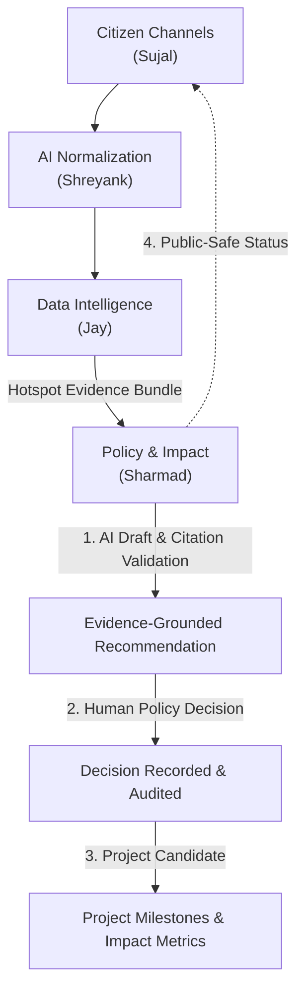

# CivicBridge AI — Policy + Impact Backend Service

**Owner:** Sharmad  
**Layer:** Part 4 (Policy + Impact)  
**Status:** Demo-ready & Production Spec Compliant  
**Scope:** Recommendation lifecycle, AI policy draft orchestration, evidence grounding validation, human decision audit, project candidate tracking, implementation milestones, and baseline-to-outcome impact metrics.

---

## 🏗 System Architecture



---

## 📁 Monorepo Directory Structure

```text
C:\googlehacka\
├── contract.md                               # Source-of-truth integration contract
├── services/
│   ├── policy-impact/                        # Sharmad's FastAPI Backend Service
│   │   ├── app/
│   │   │   ├── main.py                       # Application entrypoint
│   │   │   ├── config.py                     # Environment settings
│   │   │   ├── database.py                   # Repository / SQLite persistence
│   │   │   ├── api/                          # Section 9.4 REST API Endpoints
│   │   │   │   ├── recommendations.py
│   │   │   │   ├── decisions.py
│   │   │   │   ├── projects.py
│   │   │   │   ├── milestones.py
│   │   │   │   ├── metrics.py
│   │   │   │   ├── health.py
│   │   │   │   └── status_summary.py
│   │   │   ├── services/                     # Business Logic Services
│   │   │   │   ├── evidence_validator.py     # Grounding citation validator
│   │   │   │   ├── recommendation_service.py # Recommendation lifecycle
│   │   │   │   ├── policy_service.py         # Human decision audit
│   │   │   │   └── project_impact_service.py # Projects & impact metrics
│   │   │   └── stubs/                        # Upstream Service Stubs
│   │   │       ├── ai_normalization_stub.py  # Shreyank's AI brief stub
│   │   │       └── data_intelligence_stub.py # Jay's evidence bundle stub
├── packages/
│   ├── contracts/                            # Shared Pydantic / JSON Schemas
│   │   ├── events.py                         # Event envelope & event types
│   │   ├── errors.py                         # Standard error payload
│   │   ├── recommendation.py                 # Section 8.4 schema
│   │   ├── decision.py                       # Section 8.5 schema
│   │   ├── project.py                        # Project & milestone schema
│   │   └── impact.py                         # Section 8.6 impact metric schema
│   ├── event-bus/                            # Shared Event Bus
│   │   └── bus.py
│   └── test-fixtures/                        # Demo Data (India, Brazil, SA)
│       ├── india_jaipur_fixtures.json
│       ├── brazil_rio_fixtures.json
│       └── south_africa_capetown_fixtures.json
├── tests/                                    # Comprehensive Test Suite
│   ├── test_contracts.py                     # Schema validation tests
│   ├── test_recommendations.py               # Recommendation API & grounding tests
│   ├── test_policy_decisions.py              # Decision audit tests
│   ├── test_project_impact.py                # Project & impact metric tests
│   └── test_e2e_flow.py                      # Full E2E flow test
├── scripts/
│   ├── seed_demo_data.py                     # Demo data seeder
│   └── export_openapi.py                     # OpenAPI JSON exporter
├── .vscode/                                  # VS Code configuration
│   ├── launch.json                           # F5 debug configurations
│   ├── tasks.json                            # Task definitions
│   └── settings.json                         # Python settings
├── requirements.txt                          # Dependencies
├── run.ps1                                   # PowerShell runner
└── run.sh                                    # Bash runner
```

---

## ⚡ Quick Start & Verification

### Option A: Running via PowerShell / Terminal

```powershell
# 1. Run full Pytest test suite
C:\googlehacka\.venv\Scripts\pytest.exe tests -v

# 2. Seed demo data for India (Jaipur), Brazil (Rio), and South Africa (Cape Town)
C:\googlehacka\.venv\Scripts\python.exe scripts/seed_demo_data.py

# 3. Start Policy + Impact FastAPI server
C:\googlehacka\.venv\Scripts\python.exe -m uvicorn services.policy_impact.app.main:app --host 127.0.0.1 --port 8000 --reload
```

Interactive OpenAPI Documentation will be available at:  
👉 **`http://127.0.0.1:8000/docs`**

---

### Option B: Running inside VS Code

1. Open `C:\googlehacka` in VS Code.
2. Select the **Run and Debug** panel (Ctrl+Shift+D).
3. Choose **`Python: Policy + Impact FastAPI Server`** and press **F5**.
4. To run tests directly, select **`Python: Run Pytest Test Suite`**.

---

## 📡 API Endpoints Summary (Contract Section 9.4)

| Method | Endpoint | Description |
|---|---|---|
| `POST` | `/v1/recommendations` | Create recommendation from evidence bundle (with grounding validator) |
| `GET` | `/v1/recommendations/{id}` | Retrieve recommendation details and evidence references |
| `POST` | `/v1/recommendations/{id}/decisions` | Record human policy decision (`approve_for_assessment`, `request_evidence`, `defer`, `reject`) |
| `POST` | `/v1/recommendations/{id}/assignments` | Assign responsible department or reviewer |
| `POST` | `/v1/projects` | Create active project candidate (requires human approval) |
| `GET` | `/v1/projects/{id}` | Retrieve project details, milestones, and impact metrics |
| `POST` | `/v1/projects/{id}/milestones` | Add or update implementation milestone |
| `POST` | `/v1/projects/{id}/metrics` | Add versioned baseline, current, and target impact measurements |
| `GET` | `/health` | Service liveness, status, and dependency checks |
| `GET` | `/internal/v1/policy-impact/status-summary/{id}` | Public-safe processing status summary for Sujal's Citizen Channels |

---

## 🛡 Contract & Security Rules Enforced

1. **Grounding Validator:** All recommendation claim citations (`supporting_evidence_ids`) are strictly checked against valid source IDs from Jay's evidence bundle (`evidence_bundle_id`). Unsupported claims are rejected (`400 Bad Request`).
2. **Human Approval Gate:** Projects cannot be created without a recorded human policy decision (`human_approved = true`).
3. **Contract Events:** State transitions publish immutable event envelopes (`recommendation.created.v1`, `policy.decision.recorded.v1`, `project.status.updated.v1`, `impact.metric.updated.v1`) containing `event_id`, `trace_id`, and `occurred_at`.
4. **Privacy:** Public-safe status summaries contain no raw personal data, phone numbers, or exact household coordinates.
