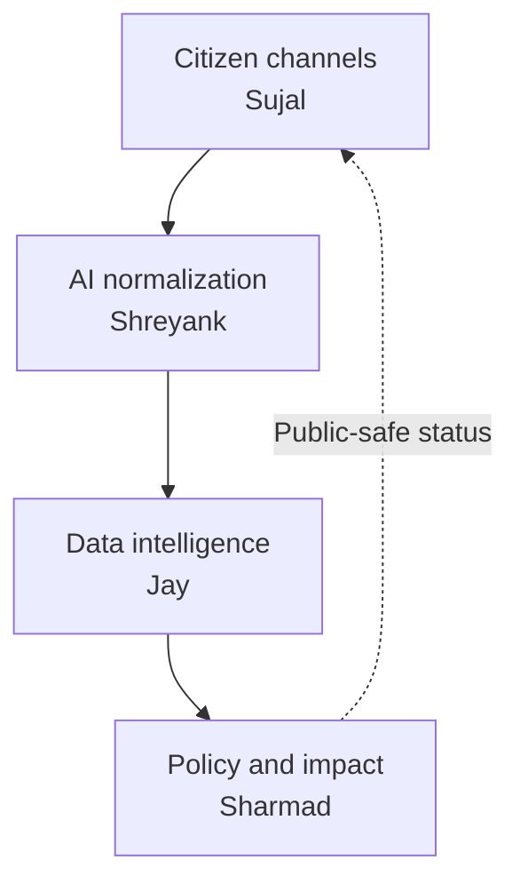

# CivicBridge AI Backend Integration Contract

**Status:** Team working agreement  
**Scope:** Backend only  
**Team:** Sujal, Shreyank, Jay, and Sharmad  
**Purpose:** Define ownership, service boundaries, APIs, events, schemas, integration rules, testing responsibilities, and the end-to-end backend definition of done.

> This is a technical collaboration contract, not a legal contract. Its purpose is to let all four backend parts be developed independently and integrate without last-minute ambiguity.

---

## 1. Backend goal

Build one reliable backend flow that converts a citizen infrastructure request into a transparent policy and impact record:

The working demo must prove this sequence:

1. Accept a citizen request containing text or audio, language, consent, and approximate location.
2. Transcribe, translate, normalize, and validate the request.
3. Detect related requests, enrich them with public data, update a hotspot, and calculate transparent scores.
4. Create an evidence-backed project recommendation.
5. Record a human policy decision.
6. Create a project impact record containing baseline, target, milestones, and current indicators.
7. Return a public-safe status to the original request.
