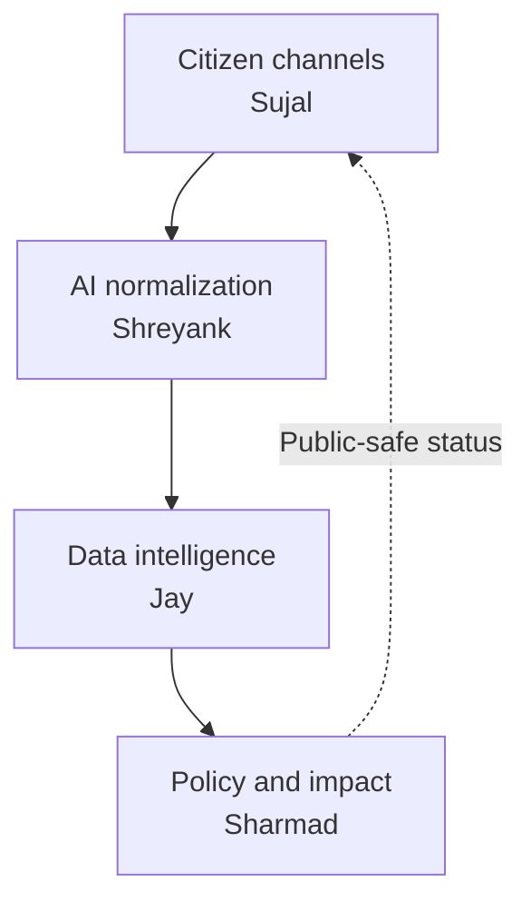

# CivicBridge AI Backend Integration Contract

**Status:** Team working agreement  
**Scope:** Backend only  
**Team:** Sujal, Shreyank, Jay, and Sharmad  
**Purpose:** Define ownership, service boundaries, APIs, events, schemas, integration rules, testing responsibilities, and the end-to-end backend definition of done.

> This is a technical collaboration contract, not a legal contract. Its purpose is to let all four backend parts be developed independently and integrate without last-minute ambiguity.

---

## 1. Backend goal

Build one reliable backend flow that converts a citizen infrastructure request into a transparent policy and impact record:



The working demo must prove this sequence:

1. Accept a citizen request containing text or audio, language, consent, and approximate location.
2. Transcribe, translate, normalize, and validate the request.
3. Detect related requests, enrich them with public data, update a hotspot, and calculate transparent scores.
4. Create an evidence-backed project recommendation.
5. Record a human policy decision.
6. Create a project impact record containing baseline, target, milestones, and current indicators.
7. Return a public-safe status to the original request.

---

## 2. Current scope

### Included

- Backend APIs and asynchronous workers.
- Request and media intake.
- Speech transcription, translation, and structured extraction.
- AI validation and human-review flags.
- Duplicate detection and clustering.
- Geographic and public-data enrichment.
- Hotspot aggregation and transparent scoring.
- Evidence-backed recommendation workflow.
- Human policy decisions.
- Project milestones and impact indicators.
- Shared schemas, test fixtures, logs, health checks, and deployment configuration.
- Seeded or realistic demo data for India, Brazil, and South Africa.

### Explicitly out of scope for this phase

- Frontend pages, components, styling, maps, and animations.
- Native WhatsApp, SMS, or social-platform integrations.
- Full government identity federation.
- Automatic allocation of public funds.
- A custom predictive model without real labels and evaluation.
- Satellite-image analysis unless the core flow is already stable.
- National-scale streaming performance claims.

The APIs should still be designed so the agreed frontend can consume them later.

---

## 3. Team ownership

| Teammate | Layer | Primary responsibility | Produces |
|---|---|---|---|
| **Sujal** | Citizen Channels | Receive citizen content, validate consent/files, store originals securely, expose status, publish request events | Canonical citizen request and secure content references |
| **Shreyank** | AI Normalization | Transcription, translation, structured extraction, validation, PII flags, confidence, and review routing | Versioned normalized request |
| **Jay** | Data Intelligence | Location enrichment, duplicate detection, public-data joins, clustering, hotspots, evidence bundles, and deterministic scoring | Versioned hotspot and score snapshot |
| **Sharmad** | Policy + Impact | Recommendation lifecycle, AI-brief orchestration, human decisions, project tracking, milestones, and impact metrics | Policy decision and impact record |

### Shared ownership

All teammates jointly own:

- `packages/contracts/`
- Event envelope and error format.
- End-to-end integration tests.
- Shared demo fixtures.
- Local orchestration and deployment documentation.
- Security and privacy rules.

No teammate may change a shared schema, event name, score contract, or endpoint response unilaterally.

---

## 4. Boundary rules

### Sujal: Citizen Channels

Sujal owns:

- Creating the canonical `request_id`.
- Capturing channel, country, language hint, consent, approximate location, text, and media references.
- File type, size, and duration validation.
- Secure original media storage.
- Request receipt and public-safe tracking status.
- Publishing `request.created.v1` and `request.confirmed.v1`.
- Receiving downstream status events and exposing safe status summaries.

Sujal does not own:

- Translation or category extraction.
- Duplicate detection.
- Hotspot calculation.
- Priority scoring.
- Recommendation generation or policy approval.

### Shreyank: AI Normalization

Shreyank owns:

- Speech-to-text for pilot languages.
- Language detection or confirmation.
- Translation while preserving original content.
- Gemini structured extraction under a strict response schema.
- Field validation, confidence values, and human-review flags.
- PII flags or masking status for analytical use.
- Publishing `request.normalized.v1` or `request.needs_review.v1`.
- Optional AI draft generation from a bounded evidence bundle when requested by the Policy service.

Shreyank does not own:

- Changing the citizen's original submission.
- Geographic scoring or hotspot ranking.
- Automatically merging uncertain duplicates.
- Storing final recommendations or policy decisions.
- Approving projects.

### Jay: Data Intelligence

Jay owns:

- Mapping approximate locations to administrative areas and spatial cells.
- Joining demographic, infrastructure, service-gap, vulnerability, and investment data.
- Duplicate-candidate calculation.
- Issue clustering and hotspot aggregation.
- Evidence-confidence calculation.
- Deterministic Need Score and Action Score.
- Versioned score explanations.
- Publishing `hotspot.updated.v1` and making evidence bundles available.

Jay does not own:

- Raw audio transcription or translation.
- Editing the canonical citizen submission.
- Generating ungrounded policy claims.
- Recording policy approval.
- Updating project implementation or impact metrics.

### Sharmad: Policy + Impact

Sharmad owns:

- Recommendation queue and status lifecycle.
- Requesting an AI draft using a bounded evidence bundle.
- Validating that recommendation claims cite supplied evidence IDs.
- Storing final recommendation versions.
- Recording approve, edit, defer, reject, assign, and request-evidence decisions.
- Creating project candidates after approval.
- Project milestones, baseline, target, current values, and outcome status.
- Publishing policy and impact status events.

Sharmad does not own:

- Recalculating Jay's hotspot scores.
- Modifying normalized citizen content.
- Treating an AI draft as an approved policy decision.
- Claiming impact without a source and measurement date.

---

## 5. Repository structure

Recommended monorepo structure:

```text
civicbridge-backend/
├── services/
│   ├── citizen-channels/        # Sujal
│   ├── ai-normalization/        # Shreyank
│   ├── data-intelligence/       # Jay
│   └── policy-impact/           # Sharmad
├── packages/
│   ├── contracts/               # Shared JSON Schema / Pydantic models
│   ├── event-bus/               # Shared publish/consume helpers
│   ├── observability/           # Logging and trace helpers
│   └── test-fixtures/           # Versioned demo records
├── infra/
│   ├── docker-compose.yml
│   ├── cloud-run/
│   └── env.example
├── tests/
│   ├── contract/
│   └── e2e/
├── docs/
│   ├── openapi/
│   └── architecture/
└── contract.md
```

Each service owns its internal code and database migrations. Other services must integrate only through published APIs, events, and shared contracts.

---

## 6. Common technical conventions

### Identifiers

- Use UUIDs for `request_id`, `cluster_id`, `hotspot_id`, `recommendation_id`, `decision_id`, and `project_id`.
- IDs are immutable and generated by the service that owns the entity.
- Never use database row numbers as public IDs.

### Time

- Store timestamps in UTC.
- Exchange timestamps as ISO 8601 strings, for example `2026-08-20T10:30:00Z`.
- Store the source timezone separately only when needed.

### Country and language

- `country_code`: ISO 3166-1 alpha-2, such as `IN`, `BR`, or `ZA`.
- `language`: BCP 47, such as `hi-IN`, `en-IN`, `pt-BR`, or `en-ZA`.
- Do not infer country solely from language.

### Geography

- Coordinates use WGS84 decimal longitude and latitude.
- All citizen-facing/overview outputs use approximate geography.
- Exact household coordinates must not be published in events or analytics tables.

### Units and currency

- Every numeric indicator includes `value`, `unit`, `source_id`, and `measured_at` or `reference_year`.
- Currency uses ISO 4217 codes such as `INR`, `BRL`, and `ZAR`.
- Cross-country comparisons use normalized rates or percentiles instead of raw request counts.

### API style

- External and staff-facing endpoints use `/v1/...`.
- Service-to-service endpoints use `/internal/v1/...`.
- JSON uses `snake_case` consistently.
- Every write accepts or generates a `trace_id`.
- Create operations that may be retried accept an `Idempotency-Key` header.
- Every endpoint has an OpenAPI definition and at least one success and error example.

### HTTP status conventions

| Status | Meaning |
|---:|---|
| `200` | Successful read or update |
| `201` | Entity created |
| `202` | Accepted for asynchronous processing |
| `400` | Invalid request format |
| `401` | Authentication required |
| `403` | Authenticated but not permitted |
| `404` | Entity not found |
| `409` | Duplicate, state conflict, or idempotency conflict |
| `422` | Schema-valid request with unacceptable field values |
| `429` | Rate limited |
| `500` | Unexpected server error |
| `503` | Required downstream service temporarily unavailable |

### Standard error response

```json
{
  "error": {
    "code": "NORMALIZATION_SCHEMA_INVALID",
    "message": "The normalized response failed schema validation.",
    "retryable": true,
    "details": [],
    "trace_id": "b96b5e2f-36e5-4d38-b490-794ad64d0198"
  }
}
```

Errors must not expose stack traces, secrets, signed URLs, or raw personal information.

---

## 7. Shared event contract

All asynchronous events use this envelope:

```json
{
  "event_id": "b514d49e-34bb-46fa-a10c-919721e528d1",
  "event_type": "request.normalized.v1",
  "schema_version": "1.0.0",
  "occurred_at": "2026-08-20T10:30:00Z",
  "producer": "ai-normalization",
  "trace_id": "b96b5e2f-36e5-4d38-b490-794ad64d0198",
  "data": {}
}
```

### Event rules

- Consumers must be idempotent using `event_id`.
- Events are immutable facts, not commands disguised as facts.
- A new incompatible payload requires a new event version.
- Additive optional fields may be introduced without changing the event name.
- Consumers must ignore unknown optional fields.
- Failed processing goes to a retry queue and then a dead-letter queue.
- Logs must include `event_id`, `event_type`, `trace_id`, service, duration, and result.
- Raw audio, raw photographs, exact personal addresses, phone numbers, and emails must not be placed directly in event payloads.

### Event ownership

| Event | Producer | Primary consumers |
|---|---|---|
| `request.created.v1` | Citizen Channels | AI Normalization |
| `request.confirmed.v1` | Citizen Channels | AI Normalization |
| `request.normalized.v1` | AI Normalization | Data Intelligence, Citizen Channels status |
| `request.needs_review.v1` | AI Normalization | Citizen Channels status, analyst workflow |
| `hotspot.updated.v1` | Data Intelligence | Policy + Impact, Citizen Channels status |
| `recommendation.created.v1` | Policy + Impact | Citizen Channels status, audit |
| `policy.decision.recorded.v1` | Policy + Impact | Citizen Channels status, audit |
| `project.status.updated.v1` | Policy + Impact | Citizen Channels public-safe status |
| `impact.metric.updated.v1` | Policy + Impact | Data Intelligence learning/analysis, public-safe status |

---

## 8. Core payload contracts

The examples below define the minimum cross-service fields. Complete schemas must live in `packages/contracts/`.

### 8.1 Request created

Produced by Sujal:

```json
{
  "request_id": "84b50f3f-52c9-4ac5-bef0-03cc1ea43168",
  "channel": "web_voice",
  "country_code": "IN",
  "language_hint": "hi-IN",
  "content_ref": "private://citizen-content/84b50f3f",
  "location": {
    "precision": "approximate",
    "latitude": 26.9124,
    "longitude": 75.7873,
    "admin_hint": "Jaipur"
  },
  "consent": {
    "accepted": true,
    "version": "2026-08-01"
  },
  "submitted_at": "2026-08-20T10:30:00Z"
}
```

`content_ref` is an internal secure reference. Shreyank retrieves the permitted content through an authenticated internal endpoint.

### 8.2 Normalized request

Produced by Shreyank:

```json
{
  "request_id": "84b50f3f-52c9-4ac5-bef0-03cc1ea43168",
  "country_code": "IN",
  "original_language": "hi-IN",
  "transcript_original": "...",
  "translation_working": "The road floods whenever it rains...",
  "category": "drainage",
  "subcategory": "stormwater_drainage",
  "summary": "Recurring road flooding is blocking access during rain.",
  "problem_description": "...",
  "requested_outcome": "Repair or add drainage beside the road.",
  "urgency": "high",
  "affected_scope": "community",
  "location_mentions": ["Ward 42", "Jaipur"],
  "evidence_types": ["voice", "repeat_report"],
  "confidence": 0.91,
  "pii_flags": ["none"],
  "needs_human_review": false,
  "review_reason": null,
  "model": "configured-gemini-model",
  "prompt_version": "normalize-1.0.0",
  "schema_version": "normalized-request-1.0.0"
}
```

Allowed top-level categories for MVP:

```text
water, sanitation, roads, drainage, electricity, connectivity,
transport, health, education, waste, housing, environment, other
```

### 8.3 Hotspot and score snapshot

Produced by Jay:

```json
{
  "hotspot_id": "50f27173-1c2d-42d3-82ee-8ef2bfc7ef46",
  "country_code": "IN",
  "geography_id": "IN-RJ-JPR-W42",
  "category": "drainage",
  "request_count": 38,
  "unique_request_count": 29,
  "affected_population": 12400,
  "trend_30d": 0.27,
  "need_score": 78.4,
  "action_score": 73.1,
  "evidence_confidence": 0.86,
  "score_version": "priority-1.0.0",
  "evidence_bundle_id": "evb_01J5R4A3",
  "calculated_at": "2026-08-20T10:32:00Z"
}
```

### 8.4 Recommendation

Owned by Sharmad:

```json
{
  "recommendation_id": "eb8fe54f-9443-4f93-af48-c2d3712da25a",
  "hotspot_id": "50f27173-1c2d-42d3-82ee-8ef2bfc7ef46",
  "evidence_bundle_id": "evb_01J5R4A3",
  "title": "Ward 42 stormwater drainage rehabilitation assessment",
  "problem": "Recurring flooding is restricting road access during rainfall.",
  "proposed_intervention": "Conduct a feasibility assessment for drain repair and additional stormwater capacity.",
  "intended_beneficiaries": 12400,
  "supporting_evidence_ids": ["src_population_42", "cluster_drainage_42"],
  "risks": ["Current drain-capacity survey is incomplete."],
  "missing_information": ["Detailed engineering survey"],
  "confidence": 0.82,
  "status": "under_review",
  "ai_draft": true,
  "human_approved": false,
  "schema_version": "recommendation-1.0.0"
}
```

### 8.5 Policy decision

Owned by Sharmad:

```json
{
  "decision_id": "6b982f16-90db-4f05-a4d4-560370174f54",
  "recommendation_id": "eb8fe54f-9443-4f93-af48-c2d3712da25a",
  "action": "approve_for_assessment",
  "reason": "Evidence threshold met; engineering feasibility is required.",
  "actor_id": "demo-policy-reviewer",
  "actor_role": "decision_maker",
  "decided_at": "2026-08-20T10:35:00Z"
}
```

Allowed actions:

```text
approve_for_assessment, request_evidence, edit, assign, defer, reject
```

### 8.6 Impact metric

Owned by Sharmad:

```json
{
  "project_id": "66faea80-6af4-4c54-8fb6-480632ead628",
  "metric_code": "road_flooding_request_rate",
  "baseline": 18.2,
  "target": 5.0,
  "current": 12.4,
  "unit": "requests_per_10000_people_per_month",
  "source_id": "civicbridge_validated_requests",
  "measured_at": "2026-11-20T00:00:00Z",
  "confidence": 0.84
}
```

---

## 9. Service API contracts

These are minimum backend endpoints. Each owner may add internal endpoints without breaking the shared contract.

### 9.1 Citizen Channels API — Sujal

| Method | Endpoint | Purpose |
|---|---|---|
| `POST` | `/v1/requests` | Create text or voice request metadata and return `request_id` |
| `POST` | `/v1/requests/{request_id}/media` | Upload or register private media |
| `PATCH` | `/v1/requests/{request_id}/confirmation` | Store citizen corrections and publish confirmation |
| `GET` | `/v1/requests/{request_id}/status` | Return public-safe processing and project status |
| `POST` | `/v1/requests/{request_id}/corrections` | Record a citizen correction request |
| `GET` | `/internal/v1/requests/{request_id}/content` | Authenticated content retrieval for AI Normalization |
| `GET` | `/health` | Liveness and dependency status |

`POST /v1/requests` returns `202 Accepted` when downstream processing is asynchronous.

### 9.2 AI Normalization API — Shreyank

The event consumer is the primary integration. Internal HTTP endpoints support development, retry, and testing.

| Method | Endpoint | Purpose |
|---|---|---|
| `POST` | `/internal/v1/normalizations` | Normalize one request by `request_id` |
| `GET` | `/internal/v1/normalizations/{request_id}` | Retrieve latest normalization result |
| `POST` | `/internal/v1/normalizations/{request_id}/retry` | Retry a failed normalization safely |
| `POST` | `/internal/v1/policy-briefs/draft` | Produce a schema-controlled draft from a bounded evidence bundle |
| `GET` | `/health` | Liveness, model configuration, and dependency status |

The policy-brief endpoint returns a draft only. Sharmad owns validation, persistence, and policy status.

### 9.3 Data Intelligence API — Jay

| Method | Endpoint | Purpose |
|---|---|---|
| `POST` | `/internal/v1/intelligence/requests/{request_id}/process` | Enrich one normalized request |
| `GET` | `/v1/hotspots` | Query aggregated hotspots with country/category/date filters |
| `GET` | `/v1/hotspots/{hotspot_id}` | Return hotspot summary and current score |
| `GET` | `/v1/hotspots/{hotspot_id}/evidence` | Return bounded evidence bundle and provenance |
| `GET` | `/v1/hotspots/{hotspot_id}/score` | Return component values and formula version |
| `POST` | `/internal/v1/hotspots/{hotspot_id}/recalculate` | Recalculate after approved data changes |
| `GET` | `/health` | Liveness and data dependency status |

### 9.4 Policy + Impact API — Sharmad

| Method | Endpoint | Purpose |
|---|---|---|
| `POST` | `/v1/recommendations` | Create a recommendation from a hotspot evidence bundle |
| `GET` | `/v1/recommendations/{recommendation_id}` | Retrieve current recommendation and evidence references |
| `POST` | `/v1/recommendations/{recommendation_id}/decisions` | Record human decision |
| `POST` | `/v1/recommendations/{recommendation_id}/assignments` | Assign department or reviewer |
| `POST` | `/v1/projects` | Create project candidate from approved recommendation |
| `GET` | `/v1/projects/{project_id}` | Retrieve project, milestones, and impact status |
| `POST` | `/v1/projects/{project_id}/milestones` | Add or update implementation milestone |
| `POST` | `/v1/projects/{project_id}/metrics` | Add versioned impact measurement |
| `GET` | `/health` | Liveness and dependency status |

---

## 10. Data Intelligence scoring contract

Jay owns implementation and versioning of the deterministic scoring engine.

### Need Score

```text
NeedScore =
  0.25 × DemandRate
  + 0.20 × InfrastructureGap
  + 0.15 × Severity
  + 0.15 × EquityVulnerability
  + 0.10 × AffectedPopulation
  + 0.10 × RecentTrend
  + 0.05 × EvidenceConfidence
```

### Action Score

```text
ActionScore =
  0.60 × NeedScore
  + 0.20 × StrategicAlignment
  + 0.10 × DeliveryReadiness
  + 0.10 × DataConfidence
  - ExistingCoveragePenalty
```

### Scoring rules

- Every component is normalized to `0–100` before weighting.
- The response returns the component values, weights, data sources, missing fields, formula version, and calculation time.
- A missing component must use a documented fallback or reduce confidence; it must not silently become a perfect or zero score.
- Score weights never change silently.
- Cross-country comparisons use normalized measures and display coverage limitations.
- Gemini may structure evidence but must not secretly calculate or override the final deterministic score.

---

## 11. Data ownership and storage

| Data | Owner | Other services receive |
|---|---|---|
| Original request and private media | Citizen Channels | Secure reference or authorized internal response |
| Transcript, translation, AI labels, confidence | AI Normalization | Versioned normalized payload |
| Public-data features and duplicate candidates | Data Intelligence | Evidence records and confidence |
| Clusters, hotspots, and scores | Data Intelligence | Versioned hotspot snapshot and evidence bundle |
| Recommendations and decisions | Policy + Impact | Public-safe status and immutable decision events |
| Project milestones and impact metrics | Policy + Impact | Public-safe progress and versioned outcome events |

No service reads or writes another service's database directly.

---

## 12. Privacy and security rules

- Preserve original citizen content; never overwrite it with a translation or summary.
- Store media privately and expose it only through authenticated short-lived access.
- Do not put raw media or personal contact information in event payloads or logs.
- Do not show exact household coordinates in analytics or public outputs.
- Mask or exclude PII before requests enter analytical datasets.
- Use environment variables or a secrets manager; never commit credentials.
- Validate file type, size, duration, and content metadata.
- Validate every incoming and outgoing payload against the shared schema.
- Apply rate limiting to public submission endpoints.
- Require staff authorization for request evidence, decisions, and internal project records.
- Record actor, reason, timestamp, and previous state for material human changes.
- AI recommendations are drafts until an authorized human action is recorded.
- Impact claims require a source, measurement date, unit, and confidence.

---

## 13. Failure and retry contract

| Failure | Expected behavior | Owner |
|---|---|---|
| Audio transcription fails | Preserve audio, mark retryable, allow text fallback | Shreyank + Sujal status |
| Translation fails | Preserve original, retry, never invent translation | Shreyank |
| Gemini returns invalid JSON | Retry once under same schema, then human review | Shreyank |
| Location is ambiguous | Use administrative hint or mark review required | Shreyank + Jay |
| Duplicate confidence is uncertain | Return candidates; do not auto-merge | Jay |
| Public dataset unavailable | Use last valid snapshot and mark stale | Jay |
| Recommendation has unsupported claims | Reject draft and show validation failure | Sharmad |
| Policy service unavailable | Keep hotspot available and retry request later | Sharmad |
| Impact source missing | Store `measurement_pending`; do not claim improvement | Sharmad |
| Duplicate event delivery | Ignore already processed `event_id` | Every consumer |

Each service must expose retryable vs non-retryable failures and must not create an infinite retry loop.

---

## 14. Git and collaboration rules

### Branches

- `main`: stable, demo-ready code only.
- `develop`: integrated backend work.
- `feat/citizen-*`: Sujal.
- `feat/ai-*`: Shreyank.
- `feat/intelligence-*`: Jay.
- `feat/policy-impact-*`: Sharmad.
- `contract/*`: shared schema or integration changes.

### Pull requests

- No direct push to `main`.
- Normal service PRs require one teammate review.
- Shared contract, event, scoring, or database-boundary changes require two teammate reviews, including the affected consumer.
- A PR modifying an API or event must update its schema, example, tests, and changelog in the same PR.
- Keep PRs small enough to review and integrate.
- Do not reformat or rewrite another teammate's service without agreement.

### Contract change process

1. Open a short contract-change issue.
2. State the current contract, proposed change, reason, affected producers/consumers, and migration plan.
3. Update shared schema and examples.
4. Add backward-compatibility or version bump.
5. Obtain reviews from the producer and at least one affected consumer.
6. Merge contract before dependent implementation.

---

## 15. Testing contract

### Every service must provide

- Unit tests for domain logic.
- Schema validation tests.
- API success and error tests.
- Event idempotency test.
- Dependency failure test.
- Health-check test.
- One seeded happy-path fixture.
- One low-confidence or failure fixture.

### Contract tests

- Producer fixture validates against the shared JSON Schema.
- Consumer can deserialize the producer fixture.
- Unknown optional fields do not break the consumer.
- Missing required fields fail clearly.
- Version mismatch fails or routes to an explicit compatibility handler.

### End-to-end test

The shared E2E test must:

1. Create one Hindi or Portuguese request.
2. Normalize it.
3. Enrich and attach it to a hotspot.
4. Recalculate the score.
5. Create a recommendation.
6. Record a policy decision.
7. Create a project and impact metric.
8. Confirm public-safe request status.

The E2E test must also run in mock mode without paid external services.

---

## 16. Individual definition of done

### Sujal — Citizen Channels

- [ ] Text request accepted.
- [ ] Audio metadata/private media accepted.
- [ ] Consent and approximate location validated.
- [ ] `request_id` and receipt returned.
- [ ] Created/confirmed events published.
- [ ] Secure internal content endpoint works.
- [ ] Public-safe status endpoint consumes downstream events.
- [ ] Idempotency and upload failure are tested.
- [ ] OpenAPI and fixtures are committed.

### Shreyank — AI Normalization

- [ ] Original transcript preserved.
- [ ] Working-language translation produced.
- [ ] Gemini output validated against a strict schema.
- [ ] Confidence and human-review flag returned.
- [ ] PII flags/masking status returned.
- [ ] Normalized or needs-review event published.
- [ ] Invalid JSON and dependency failures have safe fallbacks.
- [ ] At least 30 representative normalization fixtures can be evaluated.
- [ ] Optional policy-draft endpoint accepts only bounded evidence.

### Jay — Data Intelligence

- [ ] Administrative area/spatial cell resolved.
- [ ] Realistic public-data features joined with provenance.
- [ ] Duplicate candidates and match reasons returned.
- [ ] Cluster/hotspot updated idempotently.
- [ ] Need Score and Action Score are reproducible.
- [ ] Every score component and source is explainable.
- [ ] Evidence bundle is versioned and bounded.
- [ ] Hotspot APIs and updated event work.
- [ ] Cross-country normalization and missing-data behavior are tested.

### Sharmad — Policy + Impact

- [ ] Recommendation created from a versioned evidence bundle.
- [ ] Unsupported claims are rejected or flagged.
- [ ] Recommendation status lifecycle works.
- [ ] Human decisions store actor, reason, and timestamp.
- [ ] Approved recommendation creates a project candidate.
- [ ] Milestones and impact metrics are versioned.
- [ ] No positive impact is claimed without evidence.
- [ ] Policy/project/impact events update public-safe status.
- [ ] Recommendation and impact APIs are documented and tested.

---

## 17. Integration checkpoints

### Checkpoint 1: Contract freeze

- Shared entities, event names, minimum payloads, error format, IDs, and enum values agreed.
- Every teammate can validate the provided fixtures locally.

### Checkpoint 2: Stub integration

- Each service runs with mock dependencies.
- Every producer publishes at least one valid fixture.
- Every consumer processes that fixture successfully.

### Checkpoint 3: Local end-to-end flow

- Docker Compose or equivalent starts all services.
- One request reaches a recommendation and impact record.
- Trace ID can be followed across all four services.

### Checkpoint 4: Real service integration

- Speech, Translation, Gemini, storage, public data, and analytics dependencies are connected where available.
- Safe fallback remains available.

### Checkpoint 5: Deployment and rehearsal

- Services expose health checks.
- Environment configuration is documented.
- Seed/reset script works.
- E2E test passes on the deployed environment.
- The team can demonstrate the backend flow and answer ownership questions.

---

## 18. Whole-team definition of done

The backend is demo-ready only when:

- [ ] All four services start from documented commands.
- [ ] Shared contracts are versioned and validated.
- [ ] One request completes the entire flow.
- [ ] Every step shares one `trace_id`.
- [ ] Original citizen content remains preserved.
- [ ] Failed AI processing enters a safe retry or review state.
- [ ] Duplicate detection does not auto-merge uncertain cases.
- [ ] Priority scoring is deterministic and explainable.
- [ ] Every recommendation claim cites supplied evidence.
- [ ] A human decision is required before project creation.
- [ ] Impact claims include source, unit, date, and confidence.
- [ ] Public status contains no private information.
- [ ] Mock mode works without external credentials.
- [ ] Unit, contract, and E2E tests pass.
- [ ] OpenAPI specifications and environment examples are current.
- [ ] Demo seed and reset commands work reliably.

---

## 19. Team decision log

Record decisions that affect more than one service.

| Date | Decision | Reason | Services affected | Approved by |
|---|---|---|---|---|
| YYYY-MM-DD | Example: freeze `request.normalized.v1` | Prevent integration drift | AI, Intelligence, Citizen status | Names |

---

## 20. Team commitment

By working against this contract, each teammate agrees to:

- Own the assigned service and its documentation.
- Respect other service boundaries.
- Publish versioned, validated contracts.
- Communicate breaking changes before implementation.
- Keep the shared E2E flow working.
- Prioritize a stable backend demo over untested extra features.

**Assigned owners**

- Citizen Channels: **Sujal**
- AI Normalization: **Shreyank**
- Data Intelligence: **Jay**
- Policy + Impact: **Sharmad**
